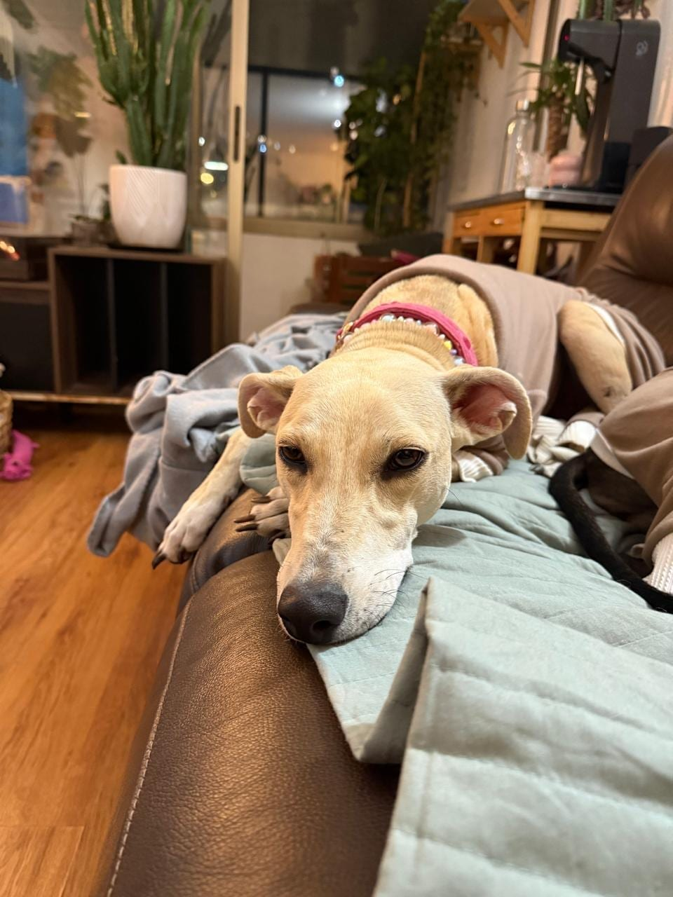
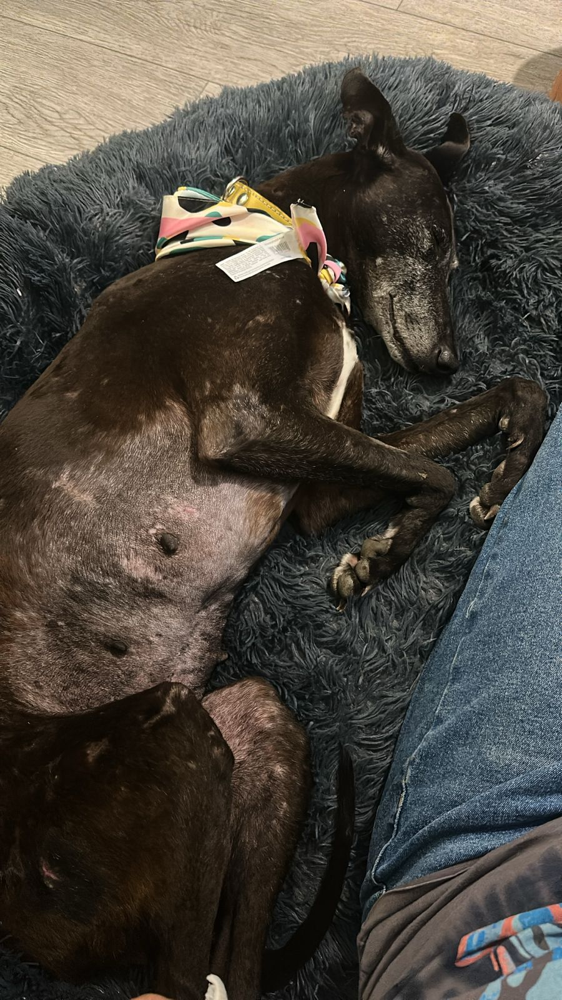
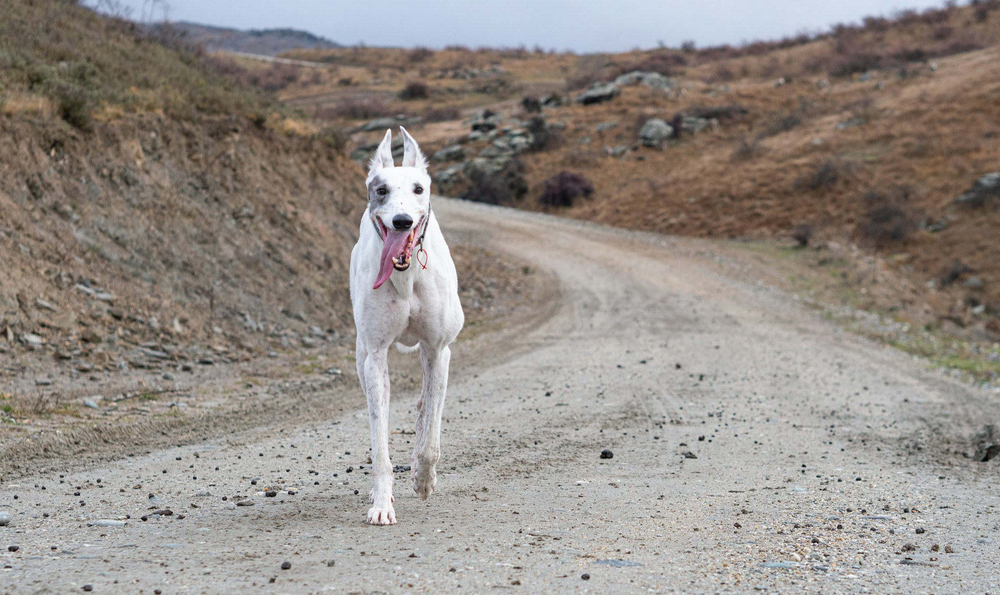

Adoptar un galgo por primera vez no se parece a elegir un objeto para la casa. Es conocer a un perro con una historia, un cuerpo muy particular y una forma propia de entender el mundo. Puede llegar caminando con elegancia, dormir doce horas seguidas y, al día siguiente, quedarse inmóvil frente a una escalera que nunca había visto. Todo eso puede ser normal.

En Brigada Galgos creemos que una buena adopción empieza antes de abrir la puerta. No porque necesites tener la casa perfecta ni saberlo todo sobre perros, sino porque preparar lo básico te permite recibir a tu galgo con menos ruido, más calma y expectativas realistas.

> No necesitas ser experto para adoptar. Necesitas estar disponible para aprender quién es el perro que llega a tu vida.

Esta guía reúne lo que más conviene mirar cuando vas a adoptar un galgo: cómo preparar el hogar, qué esperar los primeros días, por qué la seguridad es tan importante y cuándo pedir apoyo.

## Antes de adoptar: piensa en la rutina, no solo en la emoción

La foto de un galgo en el sillón puede enamorar a cualquiera. Pero la pregunta más útil no es “¿me gusta esta raza?”, sino “¿cómo se ve un día normal en mi casa?”. Un galgo necesita compañía, paseos, descanso, atención veterinaria y una familia que pueda sostener una rutina.

Antes de iniciar el proceso, conversa honestamente sobre estos puntos:

- Quién hará los paseos de la mañana, tarde y noche.
- Cuánto tiempo quedará solo y cómo será esa transición.
- Qué presupuesto hay para alimento, antiparasitarios, controles, abrigo, cama y eventuales urgencias.
- Si el hogar tiene balcones, ventanas, portones o escaleras que deben hacerse más seguros.
- Cómo se presentará a niños, gatos, perros residentes o visitas frecuentes.
- Qué pasará en vacaciones, cambios de casa o jornadas largas de trabajo.

No hay una respuesta única. Hay personas que viven solas y adoptan con una gran red de apoyo; familias numerosas con rutinas muy ordenadas; departamentos pequeños que funcionan perfecto. Lo importante es no asumir que el galgo “se las arreglará”. La adaptación se construye entre todos.

## Prepara una casa segura antes de que llegue

Los galgos son lebreles: perros seleccionados para reaccionar a lo que ven y perseguir a gran velocidad. Esa característica no los hace difíciles ni “desobedientes”, pero sí exige manejo seguro. Un pájaro, un gato, una pelota o un susto pueden activar una carrera en segundos.

Antes de la llegada, revisa puertas, portones y accesos como si fueras a cuidar a un perro recién rescatado que todavía no conoce tu voz ni tu casa. Las salidas deben abrirse con el galgo ya asegurado. En departamento, ese cuidado incluye el pasillo, ascensor, hall y estacionamiento; en casa, incluye rejas, visitas y portones de autos.

Una lista sencilla ayuda mucho:

- Arnés bien ajustado y correa firme, revisados con el equipo de adopción si es necesario.
- Placa de identificación y datos de contacto actualizados.
- Ventanas y balcones protegidos; nada de acceso libre a barandas abiertas.
- Basura, medicamentos, productos de limpieza y comida riesgosa fuera de alcance.
- Cables, objetos frágiles y plantas tóxicas resguardados en los primeros días.
- Una regla familiar clara: nadie abre una puerta exterior sin saber dónde está el galgo.

La correa no es un castigo ni una fase que se supera rápido. En espacios abiertos, es la herramienta que evita una pérdida. Un galgo puede ser muy cariñoso y estar muy conectado contigo; aun así, su impulso visual puede ser más rápido que cualquier llamado.

## Arma su rincón: una cama no es un lujo

Los galgos tienen pelo corto, piel fina y poca grasa corporal. Por eso suelen buscar mantas, sol y superficies blandas. Una cama gruesa y un lugar tranquilo no son detalles decorativos: son parte de su bienestar.

Elige un rincón sin corrientes de aire y con poco tránsito. Al comienzo, evita cambiarle el lugar cada día o invitarlo a todas las piezas a la vez. Tener un punto propio le permite descansar y observar sin sentirse obligado a participar.

También vale la pena mirar el piso. Cerámica, porcelanato y piso flotante pueden ser muy resbalosos para un galgo que viene inseguro o que nunca ha caminado sobre esas superficies. Alfombras antideslizantes en pasillos, junto a la cama y cerca de la puerta pueden cambiar mucho la experiencia. Si se queda congelado, abre las patas o no quiere avanzar, no lo arrastres: dale tiempo y facilita el camino.

En Santiago, el abrigo merece su propio espacio. Una manta y, según la temperatura y el perro, un polar o chaleco para las salidas frías suelen ser necesarios. Tiritar no es una maña; puede ser una señal de que tiene frío.

## Los primeros días no son una prueba de personalidad

Es fácil mirar al galgo recién llegado y preguntarse si es tímido, regalón, independiente o “mañoso”. Pero durante los primeros días todavía está entendiendo dónde está. Puede dormir mucho, comer poco, seguirte a todas partes, esconderse, no saber jugar o reaccionar a sonidos cotidianos. Ninguna de esas conductas define por completo al perro que será después.

La mejor bienvenida suele ser aburrida en el buen sentido: pocas visitas, paseos cortos y conocidos, horarios repetidos y un volumen de vida moderado. No necesita una fiesta de bienvenida ni conocer a toda la familia extendida el primer fin de semana.

Deja que se acerque a su ritmo. Si busca caricias, ofrécelas con calma; si se aleja, respeta esa decisión. Muchos galgos necesitan aprender que una mano no siempre pide algo, que una cama no será quitada y que dormir profundo es seguro.

> La confianza no se exige. Se acumula en cosas pequeñas: una comida a la misma hora, una puerta que no se cierra de golpe, un paseo sin apuro.

## Paseos: menos espectáculo, más seguridad y olfato

Un galgo no necesita demostrar velocidad para estar bien. Los paseos diarios sirven para hacer sus necesidades, moverse, olfatear, mirar el barrio y compartir contigo. Al inicio, es mejor elegir recorridos tranquilos que intentar cansarlo con una salida larguísima o llevarlo a una plaza llena de estímulos.

Cada perro tiene necesidades distintas según edad, salud, energía y etapa de adaptación. Como punto de partida, piensa en salidas repartidas durante el día, con un paseo principal que permita caminar y oler sin apuro. El equipo que acompañe la adopción y tu veterinario pueden ayudarte a ajustar esa rutina.

Evita soltarlo en plazas abiertas. Si quieres ofrecerle una carrera, debe ser en un recinto cerrado, revisado y seguro. Tampoco es necesario convertirlo en compañero de trote de inmediato: sus cuerpos son atletas, pero eso no significa que todos necesiten ni disfruten ejercicio intenso. Caminar de forma regular y con seguridad suele ser mucho más valioso que perseguir kilómetros.

En verano, cuida el horario y el pavimento caliente. En invierno, revisa abrigo y lluvia. Llevar agua cuando el paseo será más largo es una buena costumbre. Y si el galgo se detiene, observa antes de insistir: puede estar procesando un ruido, una bicicleta, otro perro o algo que tú no viste.

## Alimentación, salud y manejo amable

La alimentación debe responder a la edad, condición corporal y recomendaciones veterinarias de cada galgo. No cambies de alimento de golpe sin orientación, especialmente durante una adaptación que ya viene cargada de novedades. Agua fresca siempre disponible, horarios claros y observar apetito, deposiciones y ánimo te dará información útil.

Agenda un control veterinario de acuerdo con el proceso de adopción y mantén al día vacunas, antiparasitarios y esterilización cuando corresponda. Lleva preguntas anotadas: qué alimento usar, cómo reconocer un peso saludable, cuándo revisar dientes o uñas, y qué cambios ameritan consulta.

El manejo también importa. Por su piel y poca cobertura corporal, un tirón brusco, una superficie dura o el juego demasiado intenso pueden incomodarlos más de lo que parece. Enseña con refuerzo positivo: premios pequeños, voz tranquila y sesiones cortas. Los lebreles suelen responder mejor a la paciencia que a la presión.

## Convivencia con otros animales, niños y visitas

“¿Se lleva bien con gatos?” no tiene una respuesta automática. Algunos galgos conviven muy bien con gatos u otros animales después de una evaluación y presentación cuidadosa. Otros no son adecuados para convivir con animales pequeños por su impulso de persecución. La honestidad en este punto protege a todos.

Si hay otro perro en casa, la presentación debe ser gradual y en un contexto manejable. No esperes amistad instantánea; primero buscamos convivencia segura. Con niños, la regla es respetar el descanso: no abrazar al perro mientras duerme, no subirse a su cama, no tirarle de las patas ni molestarlo cuando come. La supervisión adulta siempre es necesaria, incluso con el galgo más dulce.

Para las visitas, prepara un lugar donde pueda retirarse. No todos disfrutan que alguien nuevo les hable encima o los toque al llegar. Pedir a las personas que lo ignoren al principio suele ser más amable que insistir en saludarlo.

## Enseñar a quedarse solo se hace de a poco

Algunos galgos duermen sin dificultad cuando su familia sale. Otros, especialmente quienes han pasado por abandono o muchos cambios, necesitan aprender que una salida no significa que no volverás. No hay que probarlo dejándolo solo una jornada completa desde el día uno.

Empieza con ausencias cortas y previsibles. Deja su espacio listo, evita despedidas dramáticas y vuelve con calma. Observa qué ocurre: si descansa, si vocaliza, si intenta escapar o si muestra señales de angustia. Una cámara puede ayudar a mirar sin interpretar desde la culpa.

Si aparecen ladridos persistentes, destrucción, pánico o intentos de fuga, no lo castigues. Habla con el equipo de adopción y busca orientación profesional con enfoque respetuoso. La ansiedad no se resuelve con retos; se acompaña entendiendo la causa.

## Lo que sí es normal y lo que merece ayuda

Durante la adaptación son frecuentes el sueño prolongado, la cautela, cambios leves de apetito y el desconcierto frente a objetos comunes. También puede tomar tiempo aprender escaleras, subir al auto, caminar sobre pisos brillantes o aceptar una correa.

En cambio, pide apoyo sin esperar si ves señales de dolor, decaimiento marcado, falta de apetito sostenida, vómitos o diarrea repetidos, dificultad para respirar, heridas, cojera, pánico intenso o intentos de escape. Tu veterinario y la organización son parte de la red: no tienes que resolver todo solo.

## Adoptar también es dejarse acompañar

Una adopción responsable no termina cuando se firma un formulario o se sube una foto. Los ajustes de horario, las dudas por el primer paseo y las pequeñas victorias —la primera siesta panza arriba, la primera cola moviéndose al verte— son parte del proceso.

Tener un galgo es vivir con un perro sensible, rápido, observador y profundamente particular. Algunos se vuelven compañeros de sillón desde el primer día; otros te hacen esperar para mostrar cariño. Todos merecen una familia que pueda mirar más allá de la apariencia y ofrecerles tiempo.

Si estás listo para conversar sobre una adopción, revisa nuestros [galgos disponibles](/adoptar/). Cuéntanos cómo es tu rutina, tu hogar y tus dudas. Encontrar el calce correcto es la mejor forma de que una llegada se convierta, de verdad, en hogar.

