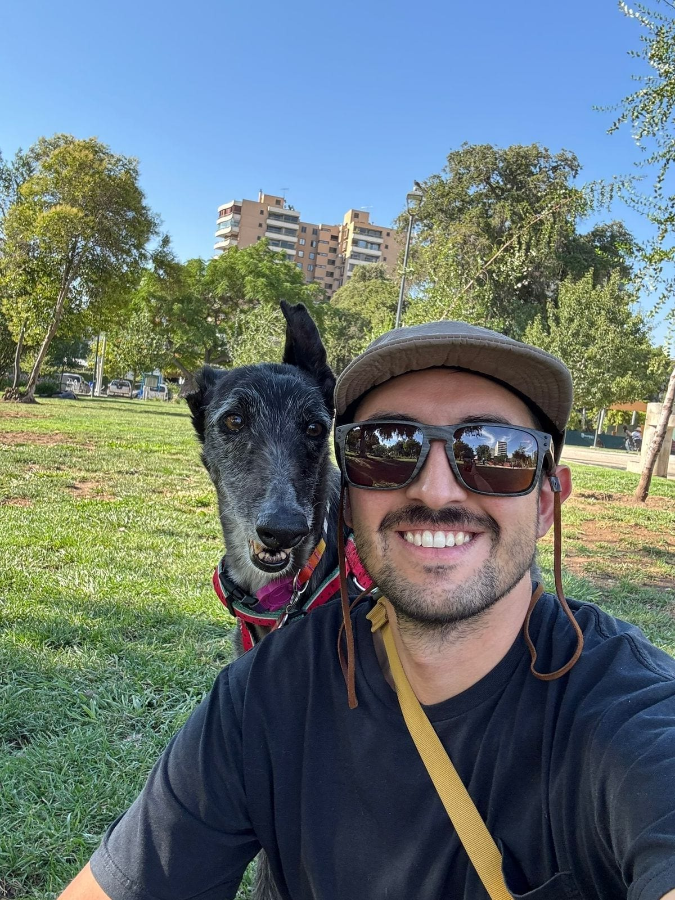

Cuando alguien piensa en adoptar un perro grande viviendo en departamento, casi siempre aparece la misma duda: "¿No será demasiado?". En Santiago esa pregunta se repite mucho. Hay ascensores, conserjería, vecinos sensibles al ruido, turnos largos de trabajo, plazas con perros sueltos y departamentos donde el living también es comedor, oficina y zona de descanso.

Con los galgos, la respuesta suele sorprender. No porque sean perros mágicos ni porque todos sean iguales, sino porque su forma de moverse, descansar y relacionarse con la casa calza muy bien con la vida urbana cuando hay rutina, seguridad y acompañamiento.

En Brigada Galgos vemos esto todo el tiempo. Muchas de nuestras adopciones terminan en familias que viven en departamento, no en casas con patio. Y muchas veces el galgo no solo se adapta: se vuelve el miembro más tranquilo de la casa.

> Un galgo no necesita un patio para estar bien. Necesita una rutina amable, paseos seguros y un lugar blando donde por fin pueda descansar.

## El gran mito: perro grande no siempre significa perro intenso

El error más común es medir la vida en departamento por tamaño corporal. Un perro chico puede ser muy vocal, muy activo o muy sensible a los ruidos del pasillo. Un perro grande puede pasar buena parte del día durmiendo si sus necesidades están cubiertas.

Los galgos son lebreles. Eso significa que fueron seleccionados para correr rápido en tramos cortos y perseguir con la vista. No son perros de pastoreo, no fueron criados para trabajar durante horas siguiendo instrucciones, y tampoco son perros guardianes que estén pendientes de cada sonido del edificio. Su energía aparece en ráfagas. Después viene el descanso.

Por eso se les dice, con cariño, "atletas de sofá". Pueden correr con una potencia impresionante, pero en la casa suelen buscar cama, alfombra, sol de ventana o el rincón más cómodo del sillón. Para una familia de departamento, esa diferencia importa mucho más que los centímetros de altura.

## ¿Cuánto ejercicio necesita un galgo en departamento?

La respuesta práctica: paseos diarios, no una maratón. Muchos galgos están bien con dos o tres salidas al día, combinando paseos para baño, olfateo y caminata tranquila. Para una familia promedio, pensar en dos paseos de 20 a 30 minutos más salidas breves para baño suele ser un buen punto de partida. Algunos necesitarán más. Otros, sobre todo los mayores o recién rescatados, preferirán avanzar de a poco.

Lo importante es entender el tipo de ejercicio. Un galgo no necesita trotar una hora al lado de una bicicleta. Necesita caminar, oler, mirar, descargar energía de forma segura y volver a una casa predecible. Si existe la posibilidad de correr, debe ser en un espacio cerrado y controlado. En la calle, la correa no es negociable.

Los galgos pueden pasar de cero a carrera en un segundo si ven un gato, una pelota, una liebre imaginaria o un perro chico corriendo. No es desobediencia. Es instinto. Por eso recomendamos arnés seguro, collar bien ajustado según el caso, correa firme y mucha atención en entradas de edificio, estacionamientos, plazas abiertas y puertas de ascensor.

## ¿Y si no tengo patio?

El patio ayuda para algunas cosas, pero no reemplaza el paseo. Un perro con patio igual necesita salir, oler el mundo, ver personas, moverse con su familia y tener estímulos distintos. Un departamento sin patio puede funcionar muy bien si la rutina está pensada.

En la práctica, lo que más ayuda es esto:

- Un lugar fijo de descanso, lejos de corrientes de aire y del paso constante.
- Paseos a horarios relativamente estables.
- Una cama blanda, porque los galgos tienen poca grasa corporal y apoyan huesos largos.
- Pisos seguros o alfombras al principio si el departamento tiene cerámica, porcelanato o piso flotante muy resbaloso.
- Paciencia con ascensores, escaleras, puertas automáticas y ruidos nuevos.

El metro cuadrado más importante de la casa no suele ser el patio. Es ese rincón donde el galgo aprende que nadie lo va a apurar.

## Una rutina realista para Santiago

Cada familia ajusta la rutina a sus horarios, pero una vida razonable para un galgo de departamento puede verse así:

1. Salida corta en la mañana para baño y una caminata tranquila.
2. Descanso largo mientras la familia trabaja, estudia o sale.
3. Paseo principal en la tarde, con tiempo para oler y moverse sin apuro.
4. Salida breve antes de dormir, especialmente al inicio de la adaptación.

Si trabajas fuera de casa, hay que mirar el caso completo: edad del galgo, tolerancia a quedarse solo, presencia de otros animales, horarios de paseo y red de apoyo. Algunos galgos duermen sin problema durante varias horas. Otros necesitan una transición más acompañada, sobre todo si vienen recién saliendo de abandono, canil o cambios bruscos.

Por eso en Brigada preguntamos por la rutina. No es para juzgar si tu departamento es grande o chico. Es para saber qué galgo podría estar bien contigo y cómo acompañar los primeros días.

## Vecinos, ladridos y vida de edificio

El ruido es una preocupación legítima. En muchos edificios, un perro que ladra durante el día puede generar reclamos rápidos. La buena noticia es que muchos galgos son perros silenciosos. No suelen ser guardianes ni perros de alerta permanente. Pueden avisar ante algo puntual, pero en general no viven comentando cada ruido del pasillo.

Eso no significa que nunca ladren ni que todos sean iguales. Un galgo puede vocalizar por ansiedad, miedo, juego, frustración o dolor. Si el ladrido aparece cuando queda solo, no se corrige retándolo. Se trabaja la causa: adaptación gradual, enriquecimiento, paseos suficientes, un espacio seguro y apoyo cuando hace falta.

También ayuda preparar el edificio. Al principio conviene bajar con calma, evitar saludos intensos en espacios estrechos, esperar el ascensor con distancia si hay otros perros y no soltar la correa dentro del hall. Un galgo asustado puede retroceder muy rápido. Un galgo entusiasmado también.

## Frío, calor y camas: cuidados más importantes que el espacio

Si hubiera que elegir una adaptación básica para un galgo en Santiago, no sería "tener patio". Sería tener abrigo.

Los galgos tienen pelo corto, piel fina y poca grasa corporal. En otoño e invierno, especialmente en mañanas frías o departamentos con poca calefacción, pueden necesitar polar, chaleco o manta. No es moda. Es bienestar. Muchos tiemblan de frío antes de que una persona sienta que la temperatura está tan baja.

También necesitan una cama blanda. Su cuerpo es largo, huesudo y liviano para correr, no para dormir en piso duro. Una cama gruesa evita molestias, ayuda al descanso y les da un lugar propio. Si el departamento recibe sol de tarde, probablemente ese punto se transformará en territorio galgo.

Con el calor pasa algo parecido: cuidado con paseos en horas de mucho sol, pavimento caliente y poca sombra. En verano santiaguino, las salidas largas funcionan mejor temprano o al atardecer. Agua disponible siempre.

## Seguridad dentro del departamento

La vida de departamento tiene detalles propios. Algunos son obvios solo después de vivir con un galgo.

Las ventanas y balcones deben estar protegidos. Un galgo no debería tener acceso libre a una terraza con barandas abiertas, muebles que pueda usar como escalón o ventanas bajas sin seguridad. No porque "quiera escapar", sino porque un susto o un estímulo puede hacerlo reaccionar antes de pensar.

Los pisos resbaladizos también importan. Muchos galgos recién llegados no conocen cerámicas brillantes, escaleras interiores o ascensores. Pueden caminar tiesos, abrir las patas o negarse a avanzar. Alfombras, bajadas de cama y pasillos despejados ayudan mucho los primeros días.

Otra recomendación simple: al inicio, deja la correa puesta antes de abrir la puerta del departamento. En edificios hay demasiados puntos de fuga juntos. Puerta, pasillo, ascensor, hall y calle pueden convertirse en una secuencia difícil si el perro se asusta.

> La correa no limita la vida de un galgo. La protege mientras aprende que la ciudad también puede ser un lugar seguro.

## ¿Pueden vivir con niños, gatos u otros perros?

Depende del galgo, del otro animal y de la forma de presentar. Muchos galgos conviven bien con otros perros. Algunos viven con gatos después de una evaluación cuidadosa. Otros no son adecuados para animales pequeños por su instinto de persecución. Es mejor decirlo así, con honestidad, que prometer una convivencia universal.

Con niños, la clave está en enseñar respeto por el descanso. Los galgos pueden ser suaves y cariñosos, pero muchos duermen profundo. No conviene despertarlos de golpe, abrazarlos mientras duermen ni invadir su cama. Un niño puede participar en la rutina, ayudar a preparar el paseo o dejar premios, siempre con supervisión adulta.

Si ya tienes perro, evaluamos energía, tamaño, carácter y manejo en espacios reducidos. Dos perros tranquilos pueden vivir muy bien en departamento. Un perro muy insistente con un galgo tímido puede hacerlo pasar mal. Caso a caso.

## Los primeros días: menos visitas, más rutina

Una de las mejores cosas que puedes hacer por un galgo recién adoptado es no llenarle la agenda. No necesita conocer a toda la familia el primer fin de semana. No necesita ir a la plaza más concurrida. No necesita probar todos los cafés pet friendly de la comuna.

Necesita entender dónde se duerme, cuándo se sale, quién lo cuida y qué sonidos son parte normal de la casa. El refrigerador. El ascensor. La aspiradora. El camión de la basura. Los perros del piso de arriba. La vida urbana está llena de información.

Durante los primeros días, recomendamos paseos simples y repetidos, una zona de descanso clara, pocas visitas y supervisión tranquila. Si se esconde o mira todo con desconfianza, no significa que la adopción vaya mal. Muchas veces significa que por fin tiene tiempo para procesar.

## Señales de que la rutina va bien

Un galgo que se está adaptando suele empezar a mostrar cambios pequeños:

- Duerme de lado o panza arriba.
- Come con más confianza.
- Se acerca a pedir cariño, pero también se retira cuando necesita pausa.
- Camina mejor en el pasillo o el ascensor.
- Aprende horarios y espera el paseo con calma.
- Busca su cama después de una salida.

No todos avanzan al mismo ritmo. Algunos llegan y parecen haber vivido siempre en departamento. Otros necesitan semanas. Lo importante es no medir el éxito por una foto perfecta, sino por señales de seguridad cotidiana.

## Cuándo un departamento podría no ser suficiente

Hay casos en que el problema no es el departamento, sino la rutina. Si nadie puede pasear al perro, si va a quedar solo demasiadas horas desde el primer día, si no hay disposición a usar correa siempre, si el balcón no es seguro o si la familia espera un perro que "se arregle solo", adoptar cualquier perro puede ser difícil.

También hay galgos que necesitan condiciones particulares: más compañía, menos ruido, otro perro estable, una familia sin gatos o una persona con experiencia. Por eso el proceso de adopción no debería sentirse como una compra rápida. Debe ser una conversación.

En Brigada acompañamos ese proceso. Te preguntamos por tu casa, tus horarios y tus expectativas para cuidar al galgo y también para cuidarte a ti. Si una adopción no resulta, no desaparecemos. Seguimos presentes y buscamos una salida responsable.

## Entonces, ¿un galgo es buena idea para departamento?

Muchas veces, sí. Especialmente si quieres un perro grande, tranquilo puertas adentro, sensible, cariñoso y compatible con una vida urbana ordenada. Un galgo puede vivir feliz en un departamento de Santiago si tiene paseos, descanso, abrigo, seguridad y una familia dispuesta a aprender su ritmo.

No necesitas una casa enorme para darle una buena vida. Necesitas compromiso, una rutina posible y ganas de acompañarlo en la transición. Para un galgo que viene de abandono, maltrato o incertidumbre, ese cambio puede ser inmenso.

Si estás pensando en adoptar, mira los [galgos disponibles](/adoptar/) y escríbenos con tus dudas. No necesitas tener todo resuelto antes de conversar. Nosotros te orientamos para saber si este es el momento, qué tipo de galgo podría estar bien contigo y cómo preparar tu departamento antes de recibirlo.
