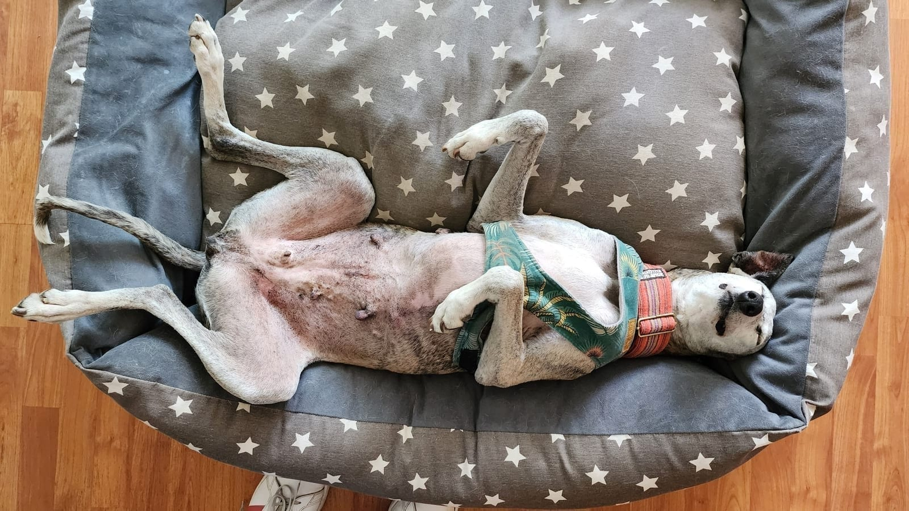
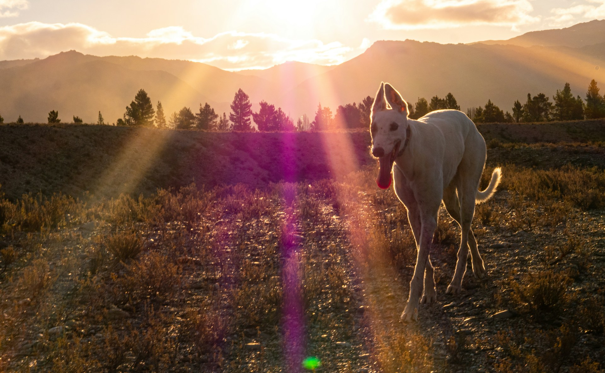
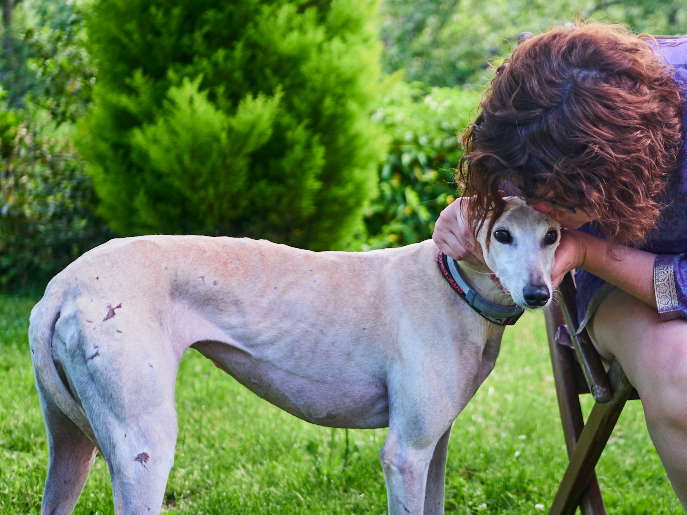

Los galgos tienen una forma especial de entrar a una habitación. A veces llegan caminando en puntillas, con esas patas largas que parecen ocupar todo el pasillo. A veces se doblan hasta caber en una cama inesperadamente pequeña. Y a veces se quedan mirando en silencio, como si estuvieran leyendo una conversación que nadie más nota.

Quienes los conocen suelen hablar primero de su elegancia. Es difícil no hacerlo: el cuerpo delgado, el pecho profundo, la cabeza fina y esa velocidad que aparece como un relámpago son inconfundibles. Pero vivir con un galgo revela algo mucho más interesante. Detrás del atleta hay un perro sensible, gracioso, independiente a su manera y muy capaz de construir vínculos profundos.

No todos los galgos son iguales. No todos vienen de la misma historia, ni disfrutan lo mismo, ni se adaptan al mismo ritmo. Aun así, hay rasgos que ayudan a entender por qué tantas familias se enamoran de ellos y por qué una adopción responsable puede ser tan especial.

## Son atletas de ráfagas, no máquinas de ejercicio

El galgo pertenece a los lebreles, perros desarrollados para localizar y seguir lo que se mueve usando la vista. Su anatomía está hecha para acelerar: cuerpo liviano, patas largas, pecho amplio y una columna flexible. Esa capacidad es real y merece respeto. Pero no significa que necesite correr sin parar todo el día.

En casa, muchos galgos pasan largas horas descansando. Por eso se ganó el apodo de “atleta de sofá”. Disfrutan un paseo, una salida segura y la oportunidad de olfatear, pero también valoran muchísimo una cama blanda y una rutina tranquila. Para personas que sueñan con un perro grande sin querer un nivel de actividad constante dentro de la casa, esta combinación puede ser maravillosa.

La clave está en no confundir tranquilidad con falta de necesidades. Necesitan paseos diarios, conexión, estimulación y oportunidades seguras para moverse. Y por su impulso de persecución, una carrera solo debe ocurrir en un lugar cerrado y bien protegido. En la calle, el arnés y la correa son parte del cuidado.

> Un galgo puede dormir toda la tarde y, aun así, necesitar una familia atenta a su seguridad, su cuerpo y sus emociones.

## Tienen una sensibilidad que cambia la forma de convivir

Muchos galgos son observadores. Perciben cambios de tono, ruidos nuevos, movimientos bruscos y tensiones en el ambiente. Eso no los vuelve frágiles: los vuelve perros que agradecen la coherencia.

Una rutina clara, un entrenamiento amable y tiempo para procesar lo nuevo les permite mostrar lo mejor de sí. Los retos fuertes, la obligación de saludar a todo el mundo o la idea de que deben “acostumbrarse” de golpe suelen ir en contra de esa confianza. Con un galgo, avanzar lento no es perder tiempo; es construir seguridad.

Esa sensibilidad también tiene una cara hermosa. Cuando un galgo decide acercarse, apoyar el hocico en tu pierna o dormir tranquilo a tu lado, suele hacerlo desde un vínculo muy genuino. Puede que no sea el perro que recibe a cada visita haciendo fiesta. Puede que sea el que te sigue a otra pieza sin hacer ruido, el que te espera en la puerta o el que se acomoda a tu lado cuando el día fue difícil.

## Su tranquilidad en casa sorprende

El tamaño puede engañar. Muchas personas creen que un perro alto necesita necesariamente una parcela. Sin embargo, un galgo puede vivir muy bien en departamento si cuenta con una rutina posible, paseos, abrigo, cama cómoda y un hogar seguro.

No son perros guardianes que estén vigilando cada sonido del edificio. Algunos pueden ladrar o vocalizar, como cualquier perro, pero muchos son más silenciosos que otras razas de menor tamaño. Esto no es una promesa ni reemplaza el trabajo de adaptación cuando queda solo, pero ayuda a explicar por qué tantos adoptados se acomodan bien a la vida urbana.

Lo esencial no es el número de metros cuadrados. Es la calidad de la vida cotidiana: si tiene dónde descansar sin frío, si sale con regularidad, si hay tiempo para acompañarlo y si las puertas, ventanas y balcones son seguros.

## Son una lección de comodidad sin culpa

Si un galgo pudiera diseñar un hogar, seguramente incluiría una cama gruesa, una manta, una ventana con sol y alguien dispuesto a moverle un poco el cojín. Su gusto por descansar no es flojera ni exageración. Con poca grasa corporal y puntos óseos prominentes, el piso duro y el frío pueden ser incómodos.

Por eso cuidarlos también invita a mirar detalles que a veces pasamos por alto: una cama bien acolchada, un polar para las mañanas frías, sombra y agua en verano, alfombras cuando los pisos resbalan. Son gestos simples que dicen algo importante: esta casa considera tu cuerpo.

Y sí, a veces ocuparán el sillón con una seguridad que parece heredada de generaciones de reyes. La convivencia se vuelve más fácil cuando definimos desde el inicio qué espacios están permitidos y mantenemos esa regla con cariño y consistencia.

## Su personalidad tiene más humor del que parece

En las fotos los galgos suelen verse serios, casi escultóricos. En la casa pueden ser profundamente cómicos. Hay quienes se enredan en una manta sin encontrar la salida, quienes hacen una vuelta completa antes de acostarse, quienes se quedan mirando una bolsa que se movió con el viento y quienes descubren que una cama humana es un invento brillante.

Cada galgo trae sus propias rarezas. Algunos son más pegotes; otros prefieren acompañar desde cierta distancia. Algunos aman los juguetes; otros recién aprenden a jugar cuando llegan a una familia. Hay perros que se adaptan rápido al auto y otros que necesitan varias experiencias tranquilas. Conocer esa personalidad, sin exigirle que sea el galgo de Instagram, es una de las partes más entretenidas de la adopción.

## Enseñan a valorar las señales pequeñas

Con un galgo, el progreso suele verse en cosas que desde fuera parecen mínimas: comer sin mirar alrededor, bajar un escalón, pedir caricias, estirarse en el piso, mover la cola cuando escucha tus llaves. Para un perro que ha vivido abandono, encierro o muchos cambios, esas señales pueden ser enormes.

Esta forma de mirar transforma a la familia también. Se aprende a celebrar la confianza en vez de exigir demostraciones rápidas de cariño. Se aprende a observar postura, mirada y distancia. Se aprende que el bienestar no siempre es euforia: a veces es un perro que duerme profundo porque ya entendió que está a salvo.

## Su independencia también es una virtud

Los lebreles fueron criados para tomar decisiones siguiendo lo que veían, no para esperar instrucciones a cada segundo. Esa historia puede hacer que un galgo parezca algo independiente. No siempre buscará obedecer por complacer ni repetirá un ejercicio diez veces con entusiasmo.

Con refuerzo positivo, sesiones breves y expectativas claras, aprenden muchísimo. La diferencia está en la conversación: no se trata de dominar al perro, sino de darle motivos para elegir contigo. Premios, juego, voz amable y descanso son herramientas mucho más útiles que la dureza.

Esta independencia no contradice el vínculo. Un galgo puede querer estar cerca y, al mismo tiempo, decidir que hoy prefiere su cama. Respetar esa elección fortalece la confianza.

## Una adopción responsable no borra su historia: le da futuro

Hay una razón más profunda para considerar adoptar un galgo. Muchos han conocido abandono, precariedad o el uso de sus cuerpos como si solo importara correr. Adoptar no cambia el pasado, pero sí puede cambiar la forma en que continúa su vida.

Eso no significa “salvar” a un perro desde una superioridad cómoda. Significa asumir una responsabilidad real: ofrecer atención veterinaria, seguridad, paciencia y permanencia. Significa pedir ayuda si algo se complica y no abandonar cuando aparecen los primeros desafíos. El galgo no te debe gratitud; merece cuidado por quien es.

En ese proceso, casi siempre pasa algo recíproco. La familia recibe un compañero que obliga a bajar el ritmo, a mirar más y a encontrar alegría en escenas simples: una siesta al sol, una caminata tranquila, una cabeza apoyada en la rodilla.

## También requieren una adopción bien pensada

Que sean increíbles no significa que sean adecuados para cualquier hogar en cualquier momento. Hay que considerar su seguridad, su posible impulso de persecución, el tiempo de adaptación, el frío, los costos y la convivencia con otros animales. Un galgo que necesita compañía o una casa sin gatos merece una familia que pueda darle eso; no una promesa apurada.

Por eso las entrevistas y preguntas del proceso de adopción son importantes. No buscan encontrar familias perfectas. Buscan cuidar el calce entre un perro concreto y una vida concreta. A veces la respuesta será “sí, este galgo puede ser para ti”; otras veces será “esperemos” o “miremos otro perfil”. La honestidad también es amor.

## Los galgos no son un estereotipo: son compañeros

Son rápidos, pero no viven corriendo. Son grandes, pero pueden ser delicados. Parecen serios, pero muchas veces son absurdamente graciosos. Pueden ser reservados al inicio y tremendamente fieles cuando se sienten seguros. Esa mezcla es, justamente, lo que los hace inolvidables.

Si te atrae la idea de convivir con un perro noble, sensible y tranquilo puertas adentro, un galgo podría ser un compañero precioso. La mejor manera de saberlo no es idealizarlo: es conocer su realidad, preparar tu casa y conversar con quienes acompañan sus adopciones.

Revisa nuestros [galgos disponibles](/adoptar/) y escríbenos. Podemos orientarte sobre su carácter, necesidades y proceso de adaptación para que el próximo capítulo sea seguro, responsable y lleno de ese cariño silencioso que los galgos saben dar.

